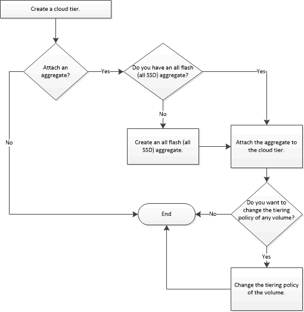

= Configure and manage cloud tiers with System Manager - ONTAP 9.7 and earlier

You can use ONTAP System Manger classic (available in ONTAP 9.7 and earlier) to configure and manage cloud tiers. Storing data in tiers can enhance the efficiency of your storage system. You manage storage tiers by using FabricPool-enabled aggregates. Cloud tiers store data in a tier based on whether the data is frequently accessed.

.Before you begin

* You must be running ONTAP 9.2 or later.
* You must have all flash (all SSD) aggregates

= Add a cloud tier
:icons: font
:imagesdir: ../media/

[.lead]
You can use System Manager to add a cloud tier to an SSD aggregate or a virtual machine disk (VMDK) aggregate. Cloud tiers provide storage for infrequently used data.

.Before you begin

* You must have the access key ID and secret key to connect to the object store.
* You must have created a bucket inside the object store.
* Network connectivity must exist between the cluster and the cloud tier.
* If communication between the cloud tier and the cluster is encrypted using SSL or TLS, the required certificates must be installed.

.About this task

The following object stores can be used as cloud tiers:

* StorageGRID
* Alibaba Cloud (Starting with System Manager 9.6)
* Amazon Web Services (AWS) Simple Storage Service (S3)
* Amazon Web Services (AWS) Commercial Cloud Service (C2S)
* Microsoft Azure Blob storage
* IBM Cloud
* Google Cloud

[NOTE]
====

* Azure Stack, which is an on-premises Azure service, is not supported.
* If you want to use any object store as a cloud tier, other than StorageGRID, you must have the FabricPool capacity license. You can add the license by clicking *Add License*.
* If you want to use an IBM Cloud Object Storage environment (such as Cleversafe), with FabricPool, you should specify a certification authority (CA) certificate. You can specify the CA certificate by moving the *Object Store Certificate* toggle button and specifying the certificate credentials.

====

.Steps

. Click *Storage* > *Aggregates & Disks* > *Cloud Tier*.
. Click *Add*.
+
A dialog box appears that lists all supported object store providers.

. From the list, select the object store provider that you want to designate as the cloud tier.
+
The Add Cloud Tier window is displayed.

. Select a region from the drop-down list in the *Region* field.
+
Based on your selection, the *Service Name (FQDN)* field is automatically populated with the server endpoint.

. Specify the access key ID of the cloud tier, the secret key of the cloud tier, and the container name.
+
If you have selected AWS Commercial Cloud Service (C2S) as the type, you must specify the CAP URL, server CA certificates, and client certificates.

. If you want to modify any of the following settings, then click the Advanced Options icon image:../media/advanced_options.gif[advanced options icon] to display the *Advanced Options* dialog window where you can make the changes:
 ** The port number used to access the cloud tier
 ** Enable or disable the *SSL* option that lets you transfer data securely to the cloud tier
. *Optional:* If you want to add a cloud tier for StorageGRID or you want to use IBM Cloud Object Storage environment (such as Cleversafe) with FabricPool, you should specify a CA certificate. Specify the CA certificate by moving the *Object Store Certificate* toggle button and copying the contents of the certificate. Then paste the certificate contents in the signed certification.
. From the *IPspace* list, select the IPspace that is used to connect to the cloud tier.
. Click *Save* to save the cloud tier.
. Click *Save and Attach Aggregates* to save the cloud tier and to attach aggregates to the cloud tier.

== Attach an aggregate to a cloud tier

You can use System Manager to attach an All Flash aggregate to a cloud tier. You can store infrequently used data in cloud tiers.

.Before you begin

You must have added a cloud tier to the cluster.

.Steps

. Click *Storage* > *Aggregates & Disks* > *Cloud Tier*.
. In the *Used in Aggregates* column, click *Attach Aggregates*.
+
The Attach Aggregates window is displayed.

. Select the aggregate that you want to attach to the cloud tier.
. Click *Save*.

== Provisioning storage by creating a FabricPool-enabled aggregate manually

You can use System Manager to create a FabricPool-enabled aggregate to attach a cloud tier to the SSD aggregate.

.Before you begin

* You must have created a cloud tier and attached it to the cluster in which the SSD aggregate resides.
* An on-premises cloud tier must have been created.
* A dedicated network connection must exist between the cloud tier and the aggregate.

.About this task

The following object stores can be used as cloud tiers:

* StorageGRID
* Alibaba Cloud (Starting with System Manager 9.6)
* Amazon Web Services (AWS) Simple Storage Service (S3)
* Amazon Web Services (AWS) Commercial Cloud Service (C2S)
* Microsoft Azure Blob storage
* IBM Cloud
* Google Cloud

[NOTE]
====

* Azure Stack, which is an on-premises Azure services, is not supported.
* If you want to use any object store as a cloud tier, other than StorageGRID, you must have the FabricPool capacity license.

====

.Steps

. Create a FabricPool-enabled aggregate by using one of the following methods:
 ** Click *Applications & Tiers* > *Storage Tiers* > *Add Aggregate*.
 ** Click *Storage* > *Aggregate & Disks* > *Aggregates* > *Create*.
. Enable the *Manually Create Aggregate* option to create an aggregate.
. Create a FabricPool-enabled aggregate:
 .. Specify the name of the aggregate, the disk type, and the number of disks or partitions to include in the aggregate.
+
[NOTE]
====
Only all flash (all SSD) aggregates support FabricPool-enabled aggregates.
====
+
The minimum hot spare rule is applied to the disk group that has the largest disk size.

 .. *Optional:* Modify the RAID configuration of the aggregate:
  ... Click *Change*.
  ... In the Change RAID Configuration dialog box, specify the RAID type and the RAID group size.
+
Shared disks support two RAID types: RAID-DP and RAID-TEC.

  ... Click *Save*.
. Select the *FabricPool* checkbox, and then select a cloud tier from the list.
. Click *Create*.

== Change the tiering policy of a volume

You can use System Manager to change the default tiering policy of a volume to control whether the data of the volume is moved to the cloud tier when the data becomes inactive.

.Steps

. Click *Storage* > *Volumes*.
. From the drop-down menu in the *SVM* field, select *All SVMs*.
. Select the volume for which you want to change the tiering policy, and then click *More Actions* > *Change Tiering Policy*.
. Select the required tiering policy from the *Tiering Policy* list, and then click *Save*.

== Edit a cloud tier

You can use System Manager to modify the configuration information of cloud tier. The configuration details that you can edit include the name, fully qualified domain name (FQDN), port, access key ID, secret key, and object store certificate.

.Steps

. Click *Storage* > *Aggregates & Disks* > *Cloud Tier*.
. Select the cloud tier that you want to edit, and then click *Edit*.
. In the *Edit Cloud Tier* window, modify the cloud tier name, FQDN, port, access key ID, secret key, and object store certificate, as required.
+
If you have selected AWS Commercial Cloud Service (C2S) cloud tier, you can modify the server CA certificates, and client certificates.

. Click *Save*.

== Delete a cloud tier

You can use System Manager to delete a cloud tier that you no longer require.

.Before you begin

You must have deleted the FabricPool-enabled aggregate that is associated with the cloud tier.

.Steps

. Click *Storage* > *Aggregates & Disks* > *Cloud Tier*.
. Select the cloud tier that you want to delete, and then click *Delete*.

== What cloud tiers and tiering policies are

Cloud tiers provide storage for infrequently accessed data. You can attach an all-flash (all-SSD) aggregate to a cloud tier to store infrequently used data. You can use tiering policies to decide whether data should be moved to a cloud tier.

You can set one of the following tiering policies on a volume:

* *Snapshot-only*
+
Moves the Snapshot copies of only those volumes that are currently not being referenced by the active file system. Snapshot-only policy is the default tiering policy.

* *Auto*
+
Moves the inactive (cold) data and the Snapshot copies from the active file system to the cloud tier.

* *Backup (for System Manager 9.5)*
+
Moves the newly transferred data of a data protection (DP) volume to the cloud tier.

* *All (starting with System Manager 9.6)*
+
Moves all data to the cloud tier.

* *None*
+
Prevents the data on the volume from being moved to a cloud tier.

== What inactive (cold) data is

Infrequently accessed data in a performance tier is known as inactive (cold) data. By default, data that is not accessed for a period of 31 days becomes inactive.

Inactive data is displayed at the aggregate level, cluster level, and volume level. The inactive data for an aggregate or a cluster is displayed only if inactive scanning is complete on that aggregate or cluster. By default, inactive data is displayed for FabricPool-enabled aggregates and SSD aggregates. Inactive data is not displayed for FlexGroups.

== Cloud Tier window

You can use System Manager to add, edit, and delete cloud tiers and to view cloud tier details.

The Cloud Tier window displays the total number of licensed cloud tiers in the cluster, the licensed space that is used in the cluster, and the licensed space that is available in the cluster. The Cloud Tier window also displays the unlicensed cloud capacity that is used.

=== Command buttons

* *Add*
+
Enables you to add a cloud tier.

* *Attach Aggregates*
+
Enables you to attach aggregates to a cloud tier.

* *Delete*
+
Enables you to delete a selected cloud tier.

* *Edit*
+
Enables you to modify the properties of a selected cloud tier.

=== Details area

You can view detailed information about cloud tiers such as the list of cloud tiers, the details of the object stores, the aggregates used, and the used capacity.

If you create a cloud tier other than Alibaba Cloud, Amazon AWS S3, AWS Commercial Cloud Service (C2S), Google Cloud, IBM Cloud, Microsoft Azure Blob storage, or StorageGRID by using the command-line interface (CLI), this cloud tier is displayed as Others in System Manager. You can then attach aggregates to this cloud tier.

*Related information*

xref:task_installing_ca_certificate_if_you_use_storagegrid_webscale.adoc[Installing a CA certificate if you use StorageGRID]

xref:reference_storage_tiers_window.adoc[Storage Tiers window]

// 2021-12-13, Created by Aoife, sm-classic rework
