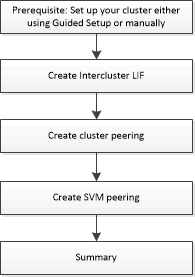

= Set up peering with System Manager - ONTAP 9.7 and earlier
:icons: font
:imagesdir: ../media/

[.lead]
You can use ONTAP System Manager classic (available in ONTAP 9.7 and earlier) to set up peering. Setting up peering involves creating intercluster logical interfaces (LIFs) on each node, creating cluster peering, and creating SVM peering.

== [[prerequisites-peering, Prerequisites for cluster peering]] Prerequisites for cluster peering

Before you set up cluster peering, you should confirm that the connectivity, port, IP address, subnet, firewall, and cluster-naming requirements are met.

=== Connectivity requirements

Every intercluster LIF on the local cluster must be able to communicate with every intercluster LIF on the remote cluster.

Although it is not required, it is typically simpler to configure the IP addresses used for intercluster LIFs in the same subnet. The IP addresses can reside in the same subnet as data LIFs, or in a different subnet. The subnet used in each cluster must meet the following requirements:

* The subnet must belong to the broadcast domain that contains the ports that are used for intercluster communication.

Intercluster LIFs can have an IPv4 address or an IPv6 address.

[NOTE]
====
ONTAP 9 enables you to migrate your peering networks from IPv4 to IPv6 by optionally allowing both protocols to be present simultaneously on the intercluster LIFs. In earlier releases, all intercluster relationships for an entire cluster were either IPv4 or IPv6. This meant that changing protocols was a potentially disruptive event.
====

=== Port requirements

You can use dedicated ports for intercluster communication, or share ports used by the data network. Ports must meet the following requirements:

* All ports that are used to communicate with a given remote cluster must be in the same IPspace.
+
You can use multiple IPspaces to peer with multiple clusters. Pair-wise full-mesh connectivity is required only within an IPspace.

* The broadcast domain that is used for intercluster communication must include at least two ports per node so that intercluster communication can fail over from one port to another port.
+
Ports added to a broadcast domain can be physical network ports, VLANs, or interface groups (ifgrps).

* All ports must be cabled.
* All ports must be in a healthy state.
* The MTU settings of the ports must be consistent.

=== Firewall requirements

Firewalls and the intercluster firewall policy must allow the following protocols:

* ICMP service
* TCP to the IP addresses of all the intercluster LIFs over the ports 10000, 11104, and 11105
* Bidirectional HTTPS between the intercluster LIFs

The default `intercluster` firewall policy allows access through the HTTPS protocol and from all IP addresses (0.0.0.0/0). You can modify or replace the policy if necessary.

== Create intercluster LIFs

Creating intercluster logical interfaces (LIFs) enables the cluster network to communicate with a node. You must create an intercluster LIF within each IPspace that will be used for peering, on each node in each cluster for which you want to create a peer relationship.

.Steps

. Click *Configuration* > *Advanced Cluster Setup*.
. In the *Setup Advanced Cluster Features* window, click *Proceed* next to the *Cluster Peering* option.
. Select an IPspace from the *IPspace* list.
. Enter the IP address, port, network mask, and gateway details of each node.
. Click *Submit and Continue*.

=== What to do next

You should enter the cluster details in the Cluster Peering window to continue with cluster peering.

== Create cluster peer relationships

You can create an authenticated cluster peer relationship to connect clusters so that the clusters in the peer relationship can communicate securely with each other.

.Before you begin

* You must have reviewed and completed the requirements for performing this task.
+
<<prerequisites-peering, Prerequisites for cluster peering>>

* You must have created intercluster logical interfaces (LIFs).
* You should be aware of which version of ONTAP each cluster is running.

.About this task

* If you want to create a peer relationship with a cluster running Data ONTAP 8.2.2 or earlier, you must use the CLI.
* You can create a peer relationship between a cluster running ONTAP 9.5 and a cluster running ONTAP 9.6. However, encryption is not supported in ONTAP 9.5, so the peer relationship cannot be encrypted.
* In a MetroCluster configuration, when you create a peer relationship between the primary cluster and an external cluster, it is a best practice to create a peer relationship between the surviving site cluster and the external cluster as well.
* You can create a custom passphrase or you can use the system-generated passphrase to authenticate the cluster peer relationship. However, the passphrases of both clusters must match.

.Steps

. Click *Configuration* > *Advanced Cluster Setup*.
. In the *Target Cluster Intercluster LIF IP addresses* field, enter the IP addresses of the remote cluster's intercluster LIFs.
. *Optional:* If you are creating a peer relationship between a cluster running ONTAP 9.5 and a cluster running ONTAP 9.6, select the checkbox.
+
The peer relationship will not be encrypted. If you do not select the checkbox, the peer relationship will not be established.

. In the *Passphrase* field, specify a passphrase for the cluster peer relationship.
+
If you create a custom passphrase, the passphrase will be validated against the passphrase of the peered cluster to ensure an authenticated cluster peer relationship.
+
If the names of the local cluster and remote cluster are identical, and if you are using a custom passphrase, an alias is created for the remote cluster.

. *Optional:* To generate a passphrase from the remote cluster, enter the management IP address of the remote cluster.
. Initiate cluster peering.
+
[options="header"]
|===
| If you want to...| Do this...
a|
Initiate cluster peering from the initiator cluster
a|
Click *Initiate Cluster Peering*.
a|
Initiate cluster peering from the remote cluster    (Applicable if you have created a custom passphrase)
a|

 .. Enter the management IP address of the remote cluster.
 .. Click the *Management URL* link to access the remote cluster.
 .. Click *Create Cluster Peering*.
 .. Specify the intercluster LIF IP addresses and passphrase of the initiator cluster.
 .. Click *Initiate Peering*.
 .. Access the initiator cluster, and then click *Validate Peering*.

|===

=== What to do next

You should specify the SVM details in the SVM Peering window to continue with the peering process.

== Create SVM Peers

SVM peering enables you to establish a peer relationship between two storage virtual machines (SVMs) for data protection.

.Before you begin

You must have created a peer relationship between the clusters in which the SVMs that you plan to peer reside.

.About this task

* The clusters that you can select as target clusters are listed when you create SVM peers by using the *Configuration* > *SVM Peers* window.
* If the target SVM resides on a cluster in a system running ONTAP 9.2 or earlier, SVM peering cannot be accepted by using System Manager.
+
[NOTE]
====
In such a scenario, you can use the command-line interface (CLI) to accept SVM peering.
====

.Steps

. Select the initiator SVM.
. Select the target SVM from the list of permitted SVMs.
. Specify the name of the target SVM in the *Enter an SVM* field.
+
[NOTE]
====
If you have navigated from the *Configuration* > *SVM Peers* window, you should select the target SVM from the list of peered clusters.
====

. Initiate SVM peering.
+
[options="header"]
|===
| If you want to...| Do this...
a|
Initiate SVM peering from the initiator cluster
a|
Click Initiate SVM Peering.
a|
Accept SVM peering from the remote cluster
a|

[NOTE]
====
Applicable for non-permitted SVMs
====

 .. Specify the management address of the remote cluster.
 .. Click the *Management URL* link to access the SVM Peer window of the remote cluster.
 .. On the remote cluster, accept the *Pending SVM Peer* request.
 .. Access the initiator cluster, and then click *Validate Peering*.

|===

. Click *Continue*.

=== What to do next

You can view the intercluster LIFs, cluster peer relationship, and SVM peer relationship in the Summary window.

When you use System Manager to create the peer relationship, the encryption status is "`Enabled`" by default.

== What passphrases are

You can use a passphrase to authorize peering requests. You can use a custom passphrase or a system-generated passphrase for cluster peering.

* You can generate a passphrase on the remote cluster.
* The minimum required length for a passphrase is eight characters.
* The passphrase is generated based on the IPspace.
* If you are using a system-generated passphrase for cluster peering, after you enter the passphrase in the initiator cluster, peering is authorized automatically.
* If you are using a custom passphrase for cluster peering, you have to navigate to the remote cluster to complete the peering process.

// 2021-12-07, Created by Aoife sm-classic rework
